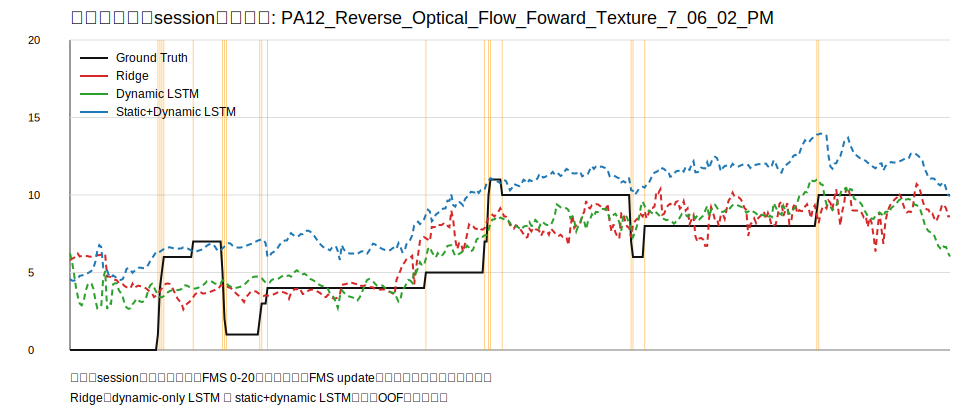
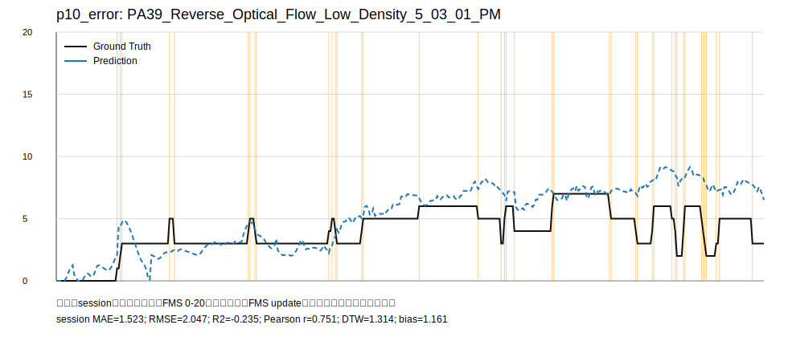
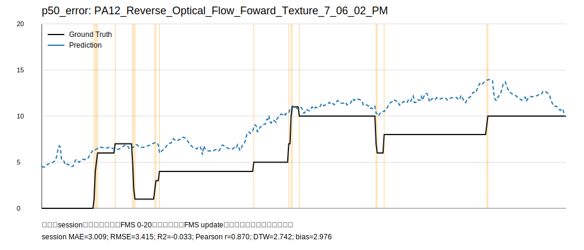
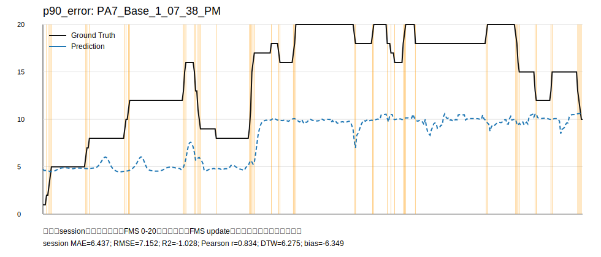

# Ryu-Kim Stage 5 综合结果报告：最终模型选型与OOF预测可视化

本报告汇总已冻结的 Ryu-Kim Stage 1-4 结果，面向论文结果整理和后续复现实验使用。所有结论均来自既有 OOF 测试预测、固定 split、已有指标、slice 结果和日志；本阶段没有进行新的模型架构训练，也没有修改原始数据、split、测试样本、预测文件或原始指标。

本文只保留对研究判断有价值的结果。没有带来稳定收益的实验不会作为主结果展示，而是在“被排除方案与阴性结果”中说明原因。

## 1. 数据与评估协议

当前公开仓库快照包含 428 个 session 文件和 86 个 `raw_pa_id` 组。由于真实参与者身份仍未确认，本文所有主结果均使用 **raw_pa_id-group-disjoint split**，不得称为 confirmed participant-disjoint split。`raw_pa_id` 只是保守分组键，不是已确认的全局参与者 ID。

主任务为：给定窗口内六轴动态特征，预测窗口末端当前 FMS。禁止输入 FMS 历史、未来帧、raw_pa_id、session ID、condition、文件名。Stage 4/5 中允许加入 session 内记录的 age/gender/MSSQ，但只能称为 **session-recorded static susceptibility features**，不能称为已确认参与者身份下的个性化特征。

主要选择指标为 session-macro MAE。次级指标包括 raw_pa_id-group macro MAE、RMSE、R2、Pearson r、bias、折间方差、高 FMS 区间、缺失窗口和 update 附近性能。sMAPE 仅为和 Ryu-Kim 论文口径对应而计算；由于 FMS 接近 0 时分母不稳定，本文不把 sMAPE 作为模型选择依据。

关键协议如下。

| 项目 | 取值 |
| --- | --- |
| session 数 | 428 |
| raw_pa_id 组数 | 86 |
| split 名称 | raw_pa_id-group-disjoint split |
| 10s split SHA256 | `ce6de3c1cc9beb6c94acee6227213a50b43ecb338ab1fc6f48a3942adfa91cd5` |
| 目标 | 窗口末端当前 FMS |
| 主指标 | session-macro MAE |
| 缺失窗口规则 | 默认排除动态缺失比例 >20% 的窗口；保留窗口内缺失用因果策略处理 |
| 禁止输入 | FMS 历史、ID、session、condition、文件名、未来帧 |

### 1.1 基本分析单位：window、session 和 group

本文同时报告 window-level、session-macro 和 raw_pa_id-group-macro 指标，是因为三者回答的问题不同。

**Window** 是模型实际接收的一个因果滑动时间窗。例如 10 秒窗口表示只使用当前时刻之前 10 秒内的六轴运动特征和 missing mask，标签是窗口末端的当前 FMS。窗口只能在同一个 session 内生成，不允许跨 session。window-level 指标反映所有测试窗口的总体平均误差，但会让长 session 或窗口更多的 session 权重更大。

**Session** 是一次实验记录，对应一个原始 CSV 文件，也就是一次 VR 体验/行走过程。session-macro 指标先在每个 session 内计算误差，再对 session 求平均，使每次实验记录拥有相同权重。本文以 session-macro MAE 作为主指标，因为最终关心的是模型是否能在一次完整实验过程中稳定预测，而不是只在窗口数量最多的 session 上表现好。

**Group** 指当前保守使用的 `raw_pa_id` 分组。所有相同 `raw_pa_id` 的 session 必须处于同一个 fold 中，避免同一 ID 前缀的数据同时出现在训练和测试中。由于真实参与者身份仍未确认，`raw_pa_id` 只能称为 conservative identifier grouping，不能称为 confirmed participant ID。raw_pa_id-group-macro 指标先按 group 汇总，再对 group 求平均，用于检查模型是否只在某些 ID 前缀组上表现好。

因此，三类指标的优先级为：session-macro MAE 是主指标；raw_pa_id-group macro 用于检查分组层面的稳健性；window-level 指标用于描述整体窗口预测误差和与其他工作对照。

### 1.2 指标定义与解释

本文主要使用 MAE、RMSE、R2、Pearson r、Spearman r、bias 和 normalized DTW。最重要的是 MAE 和 RMSE，相关系数只说明趋势一致性，不能单独代表误差小。

| 指标 | 定义 | 越大/越小 | 解释 |
| --- | --- | --- | --- |
| MAE | `mean(abs(y_pred - y_true))` | 越小越好 | 平均绝对误差，单位就是 FMS 分数，最直观 |
| RMSE | `sqrt(mean((y_pred - y_true)^2))` | 越小越好 | 均方根误差，比 MAE 更惩罚大误差 |
| R2 | `1 - sum((y_true-y_pred)^2) / sum((y_true-mean(y_true))^2)` | 越接近 1 越好 | 0 表示接近预测测试集均值；小于 0 表示比均值预测还差 |
| Pearson r | `corr(y_true, y_pred)` | 越接近 1 越好 | 衡量线性同涨同跌趋势；高相关不代表无偏或误差小 |
| Spearman r | `corr(rank(y_true), rank(y_pred))` | 越接近 1 越好 | 衡量排序趋势一致性，对非线性单调关系更宽容 |
| bias | `mean(y_pred - y_true)` | 越接近 0 越好 | 正值表示整体高估，负值表示整体低估 |
| normalized DTW | 对 session 内真实曲线和预测曲线做归一化动态时间规整距离 | 越小越好 | 用于描述完整时间线形状差异 |

需要特别注意：Pearson r 很高时，模型仍可能有较大的 MAE。例如某条 session 曲线整体随真实 FMS 上升，但预测值始终低 6 分，那么 Pearson r 可能仍然较高，而 MAE 和 bias 会显示严重低估。本文最终选型不会只看相关系数。

### 1.3 OOF 预测、训练集、验证集和测试集

OOF 是 out-of-fold prediction，即每个样本的预测都来自没有见过该样本的模型。本文使用固定 5-fold raw_pa_id-group-disjoint split：

1. 先把 86 个 `raw_pa_id` group 分成 5 个 fold。
2. 每一轮取 1 个 fold 作为测试折。
3. 剩余 4 个 fold 作为训练数据来源。
4. 标准化器、缺失处理参数、类别/分区权重只允许从训练折拟合或计算。
5. 模型在当前测试折产生预测。
6. 5 折完成后，把所有测试折预测合并，形成完整 OOF 预测集合。

这个流程保证同一个 `raw_pa_id` 的所有 session 不会同时出现在 train 和 test；同一个 session 也不会跨 train/test；窗口只在 session 内生成，不跨 session。部分阶段没有独立 validation set，或只在训练折内部使用轻量固定策略；最终报告和图形只使用测试折 OOF 预测，不使用训练集或验证集预测。

因此，OOF 预测可以理解为：对 428 个 session，每个 session 都由一个没有训练过该 session 所属 `raw_pa_id` group 的模型进行预测。它比训练集预测更接近真实泛化评估，也避免人工挑选最好样本。

## 2. 最终结论

按预先设定的分层规则，最终选择：

**10 秒单向 LSTM + 六轴动态序列 + missing mask + session-recorded age/gender/MSSQ static susceptibility features + 标准 Huber + 当前 FMS 连续回归。**

对应实验 ID 为 `stage4_static_static_dynamic`。这是当前公开源域数据快照内部的最终处理方式，但它不是 confirmed participant-personalized model，也不代表跨数据集迁移或 Unity 实时部署性能。

最终模型的统一 OOF 指标如下。

| 指标 | 数值 |
| --- | ---: |
| window MAE | 3.5617 |
| window RMSE | 4.5846 |
| window R2 | 0.2663 |
| Pearson r | 0.5458 |
| Spearman r | 0.5515 |
| bias | -0.2709 |
| session-macro MAE | 3.5718 |
| session-macro RMSE | 4.1028 |
| normalized DTW | 3.2731 |
| raw_pa_id-group macro MAE | 4.0865 |
| FMS>=10 AUPRC / F1 | 0.5660 / 0.4210 |
| FMS>=15 AUPRC / F1 | 0.3917 / 0.2379 |
| 参数量 | 6,721 |
| 平均训练耗时 | 16.71 s/fold |
| 平均推理延迟 | 0.00035 ms/window |

主要判断：这个模型不是“强预测器”，但它是当前所有受控实验中综合最稳的方案。它能从动态序列中学到有限信号，静态易感性特征能进一步解释一部分 session 间差异；但高 FMS、缺失窗口和 update 事件仍是主要短板。

## 3. 模型结构比较：哪些模型真正有效

有价值的模型比较不是“越复杂越好”，而是看是否在同一 split、同一 OOF 测试样本上稳定降低 session-macro MAE。

| 模型 | 输入 | window MAE | session MAE | group MAE | RMSE | R2 | Pearson r | 结论 |
| --- | --- | ---: | ---: | ---: | ---: | ---: | ---: | --- |
| 训练折 FMS 均值 | 无动态输入 | 4.3762 | 4.3885 | 4.7724 | 5.3809 | -0.0107 | -0.1382 | 只作下限参照 |
| Ridge window stats | 动态统计/lag | 3.8585 | 3.8679 | 4.3259 | 4.7647 | 0.2075 | 0.4559 | 有效的线性基线 |
| Stage 2 LSTM | 10s 六轴动态 + mask | 3.7338 | 3.7434 | 4.2682 | 4.6602 | 0.2419 | 0.4939 | 比 Ridge 有小幅收益 |
| Stage 2 causal TCN | 10s 六轴动态 + mask | 3.7472 | 3.7553 | 4.2503 | 4.6818 | 0.2348 | 0.4862 | 不优于 LSTM |
| Final static+dynamic LSTM | 动态 + session-recorded static | 3.5617 | 3.5718 | 4.0865 | 4.5846 | 0.2663 | 0.5458 | 综合最佳 |

解释：

1. 均值基线明显不足，说明模型不是只在复制训练集均值。
2. Ridge 已经能捕捉一部分动态统计信号，是必须保留的强基线。
3. 真正的单向 LSTM 相对 Ridge 有小幅改进，但幅度有限。
4. causal TCN 参数更多但没有带来稳定优势，因此不作为最终方案。
5. 加入 session-recorded static susceptibility features 后，session MAE、group MAE、相关性和高 FMS 检出均改善，这是最终选择的主要证据。

## 4. 历史长度：更长窗口没有稳定价值

历史长度实验使用同一类小型因果 LSTM，仅改变历史长度。全部有效窗口上，10 秒最好；20、40、60、120 秒逐步变差。

| 历史长度 | window MAE | session MAE | group MAE | Pearson r | bias |
| ---: | ---: | ---: | ---: | ---: | ---: |
| 10s | 3.6977 | 3.7095 | 4.2732 | 0.4785 | -0.8514 |
| 20s | 3.7736 | 3.7808 | 4.2938 | 0.4486 | -0.8411 |
| 40s | 3.8761 | 3.8797 | 4.3434 | 0.4060 | -0.6023 |
| 60s | 3.9914 | 3.9883 | 4.4058 | 0.3573 | -0.6802 |
| 120s | 4.2928 | 4.2768 | 4.6093 | 0.1180 | -0.9769 |

在公共测试锚点上，40 秒 MAE 为 4.2286，略低于 10 秒的 4.2510，但差值只有约 0.022，且与全部有效窗口结论相反。因此不能声称更长历史稳定优于 10 秒。

结论：**当前数据中，10 秒历史已足够；更长历史带来的样本变化、缺失累积和训练难度大于收益。**

## 5. 输入特征贡献：动态是基础，静态解释跨 session 差异，累计剂量贡献有限

Feature ablation 的核心结果如下。

| 输入组合 | session MAE | group MAE | RMSE | R2 | Pearson r | 结论 |
| --- | ---: | ---: | ---: | ---: | ---: | --- |
| dynamic sequence | 3.6931 | 4.2400 | 4.7670 | 0.2067 | 0.4866 | 基础有效信号 |
| cumulative dose only | 3.7540 | 4.2955 | 4.8167 | 0.1901 | 0.4672 | 弱于局部动态序列 |
| static only | 4.2494 | 4.7175 | 5.3660 | -0.0051 | 0.2636 | 单独不足 |
| static + dose | 3.6266 | 4.2386 | 4.7296 | 0.2191 | 0.5227 | 有少量帮助 |
| static + dynamic | 3.5718 | 4.0865 | 4.5846 | 0.2663 | 0.5458 | 最佳 |
| static + dynamic + dose | 3.5990 | 4.1876 | 4.6670 | 0.2397 | 0.5372 | 加 dose 后不再提升 |

解释：

1. 动态序列是必要输入。没有动态序列时，static-only 虽然能表达一部分易感性差异，但不足以预测时间变化。
2. session-recorded static susceptibility features 明显改善最终模型，说明 age/gender/MSSQ 记录中有跨 session 差异信息。
3. 累计运动剂量不是没有信号，但其信息大多已被局部动态序列和静态分支覆盖；加入到 static+dynamic 后反而略差。

结论：**最终特征选择 static + dynamic，而不加入 dose。**

## 6. 损失函数与高 FMS：加权损失能救高 FMS，但代价太大

高 FMS 是所有模型的主要失败区域。最终模型在 15-20 区间的 MAE 为 7.067，bias 为 -6.892，仍明显低估。

本节比较的是“同一类 10 秒 LSTM 在不同损失函数/任务设置下，对高 FMS 的处理是否更好”。这里的模型含义如下：

- **Standard Huber LSTM**：只输入六轴动态特征和 missing mask，不输入静态信息；使用标准 Huber 回归损失预测当前 FMS。Huber 损失在小误差时类似 MSE，在大误差时类似 MAE，比纯 MSE 对离群误差更稳。
- **Weighted Huber LSTM**：模型输入仍是六轴动态特征和 missing mask，但训练时按 FMS 区间给样本加权，让高 FMS 样本在损失中占更大权重。它的目的不是提高所有区间，而是专门测试“能否缓解高 FMS 低估”。
- **Multitask high-FMS LSTM**：在连续 FMS 回归之外，额外增加一个 FMS>=15 的辅助二分类任务，希望模型更关注高 FMS 状态。最终预测主指标仍看连续 FMS 回归。
- **Final static+dynamic LSTM**：最终候选模型。它使用标准 Huber 回归损失，但输入不再只是动态特征，而是六轴动态序列、missing mask，以及 session-recorded age/gender/MSSQ static susceptibility features。

因此，最终模型**不是表中第一个 Standard Huber LSTM**。最终采用的是“标准 Huber 损失”这一训练目标，但模型输入是 **static+dynamic**，对应表中最后一行。

| 模型/损失 | 总体 session MAE | 0-5 MAE | 5-10 MAE | 10-15 MAE | 15-20 MAE | 总体 bias |
| --- | ---: | ---: | ---: | ---: | ---: | ---: |
| Standard Huber LSTM | 3.6672 | 2.8862 | 2.2851 | 4.0588 | 8.9599 | -0.8048 |
| Weighted Huber LSTM | 4.0569 | 4.1855 | 3.8791 | 2.6059 | 6.0172 | +1.2719 |
| Multitask high-FMS LSTM | 3.6612 | 未作为主结果 | 未作为主结果 | 未作为主结果 | 未稳定解决 | -0.8114 |
| Final static+dynamic LSTM | 3.5718 | 3.1796 | 2.5838 | 3.6979 | 7.0670 | -0.2709 |

Weighted Huber 明显降低高 FMS MAE，但总体 session MAE 从 3.6672 恶化到 4.0569，并且低/中 FMS 区间误差明显变大，整体 bias 翻转为高估。因此它是有诊断价值的实验，但不是可接受的最终方案。

结论：**高 FMS 低估可以通过重加权缓解，但现有输入信息不足以在不牺牲总体性能的情况下稳定解决。**

## 7. 缺失数据：复杂因果填补没有实质收益

三种因果缺失策略的整体差异极小。

| 缺失策略 | session MAE | group MAE | RMSE | Pearson r | 参数量 |
| --- | ---: | ---: | ---: | ---: | ---: |
| zero after train-fold standardization + mask | 3.6672 | 4.1751 | 4.7219 | 0.4956 | 5,921 |
| causal forward fill + mask | 3.6687 | 4.2028 | 4.7252 | 0.4954 | 5,921 |
| causal forward fill + mask + time since observed | 3.6695 | 4.2005 | 4.7161 | 0.4962 | 6,689 |

最终模型中，完整动态窗口 MAE 为 3.4930；含缺失动态窗口 MAE 为 4.9635。缺失窗口显著更难，但 forward fill 和 time-since-last-observed 没有解决这个问题。

结论：**保持 zero + missing mask 是更简单且不差的策略。缺失窗口性能差更可能来自缺失模式本身与 session 条件，而不是填补算法不够复杂。**

## 8. Update 事件和未来变化：目前可预测性弱

Stage 4 构造了 FMS 更新事件、更新方向、更新幅度、阶梯持续时间，以及未来 5 秒/10 秒 FMS 变化量。未来标签只作为监督目标，没有进入模型输入。

诊断结果显示：FMS 更新事件共 15,056 次，其中上升 9,268 次、下降 5,788 次，高 FMS 事件 2,714 次。阶梯持续时间中位数约 1.053 秒，最长可达 166 秒。

本节中的多任务模型是在普通 dynamic LSTM 上增加辅助监督：主任务仍然预测当前 FMS，同时额外预测 update event，以及未来 5 秒/10 秒 FMS 变化量。这样做的动机是希望模型不仅拟合当前分数，还能学习“FMS 即将变化”的早期信号。

但多任务模型没有带来稳定架构收益：

| 模型 | session MAE | group MAE | R2 | Pearson r | 结论 |
| --- | ---: | ---: | ---: | ---: | --- |
| dynamic current-FMS | 3.7095 | 4.2732 | 0.2020 | 0.4785 | 当前 FMS 主任务基线 |
| dynamic multitask | 3.7210 | 4.2920 | 0.1967 | 0.4760 | 加 update/future 任务后略差 |

从主任务看，多任务模型的 session MAE 从 3.7095 略差到 3.7210，group MAE 从 4.2732 略差到 4.2920，说明辅助任务没有改善当前 FMS 回归，反而带来轻微负迁移。这个差异不大，但方向并不支持把多任务作为最终架构。

辅助任务本身也较弱：

| 辅助目标 | 结果 | 朴素参照 | 解释 |
| --- | ---: | ---: | --- |
| update event AUPRC | 0.0995 | 事件窗口比例约 0.0757 | 略高于事件先验，但提升很小 |
| update event F1 | 0.1502 | - | 事件检出仍弱 |
| update event recall | 0.3378 | - | 能召回一部分事件，但精度/整体 F1 不足 |
| future 5s delta MAE | 0.9200 | 永远预测 0 的 MAE 为 0.8326 | 不优于零变化基线 |
| future 10s delta MAE | 1.4308 | 永远预测 0 的 MAE 为 1.3652 | 不优于零变化基线 |

这里确实存在你指出的现象：**很多时候 FMS 是平稳不变的，所以未来变化量任务的 MAE 会天然不大。** 在 10 秒 OOF 窗口中，未来 5 秒 FMS 变化量有 66.2% 正好为 0，未来 10 秒变化量也有 51.2% 为 0。换句话说，如果模型永远预测“未来 FMS 不变”，就已经能得到 0.8326 的 5 秒变化 MAE 和 1.3652 的 10 秒变化 MAE；当前多任务模型分别为 0.9200 和 1.4308，反而略差。

因此，未来变化量的 MAE 不能单独解读为“模型会预测未来变化”。它很大程度上被 FMS 阶梯标签中的平稳段稀释。真正有价值的是非零变化段和 update 附近的表现，而这些位置正是模型较弱的地方：进入 10 秒 OOF 评估窗口的 update/near-update 窗口只有 14,550 个，占 7.57%；这些窗口上的当前 FMS MAE 约 4.16，高于 flat 窗口的约 3.66-3.68。

这说明当前六轴运动输入对“FMS 即将改变”的信息不足，或者标签更新机制本身存在滞后、阶梯化和主观评分噪声。多任务监督虽然有诊断意义，但没有证明未来变化或 update 事件可以被当前输入稳定预测。

结论：**update 和未来变化具有诊断价值，但不应作为当前最终模型的主路线。**

## 9. 高 FMS、缺失和误差来源

最终模型在 FMS 分区上的表现如下。

| FMS 区间 | n | MAE | RMSE | bias | 解释 |
| --- | ---: | ---: | ---: | ---: | --- |
| 0-5 | 68,537 | 3.1796 | 4.1053 | +2.6736 | 低 FMS 被高估 |
| 5-10 | 66,541 | 2.5838 | 3.2294 | +0.5273 | 相对最好 |
| 10-15 | 32,361 | 3.6979 | 4.4989 | -3.0783 | 中高 FMS 开始低估 |
| 15-20 | 24,780 | 7.0670 | 7.8734 | -6.8917 | 主要失败区域 |

这个模式说明模型倾向于向中间 FMS 回归：低 FMS 被抬高，高 FMS 被压低。高 FMS 的低估不是某个单一架构的问题，而是在 Ridge、LSTM、TCN、multitask 中都存在。

当前瓶颈更可能来自四个方面：

1. 标签分布不均衡，高 FMS 样本更少且更难。
2. FMS 是阶梯化评分，窗口级连续运动和评分更新时间并不完全同步。
3. 部分 session 的缺失模式与实验条件相关，缺失窗口明显更难。
4. 仅用六轴运动和 session-recorded static fields，可能缺少视觉刺激、场景、主观症状滞后等关键解释变量。

## 10. OOF 预测曲线如何解读

所有图均来自 OOF 测试预测，不使用训练集或验证集预测，也没有对评价预测做额外平滑。每条曲线对应一个 session-record 的完整时间线，而不是已确认真实参与者的完整历史。

代表 session 由固定百分位规则自动选择：

| 图 | session_uid | session MAE | RMSE | R2 | Pearson r | bias |
| --- | --- | ---: | ---: | ---: | ---: | ---: |
| p10 low-error | `PA39_Reverse_Optical_Flow_Low_Density_5_03_01_PM` | 1.5230 | 2.0471 | -0.2350 | 0.7510 | +1.1613 |
| p50 median-error | `PA12_Reverse_Optical_Flow_Foward_Texture_7_06_02_PM` | 3.0085 | 3.4152 | -0.0325 | 0.8698 | +2.9758 |
| p90 high-error | `PA7_Base_1_07_38_PM` | 6.4370 | 7.1516 | -1.0275 | 0.8341 | -6.3493 |

图像按两类展示。第一类是同一个中位误差 session 上三种模型的对比，用于观察 Ridge、dynamic-only LSTM 和 final static+dynamic LSTM 在同一条时间线上的差异。

第二类是最终模型在低误差、中位误差和高误差 session 上的 OOF 预测曲线。三张图按同一百分位规则自动选择，放在同一行便于比较模型成功、典型和失败情形。

| p10 low-error | p50 median-error | p90 high-error |
| --- | --- | --- |
|  |  |  |

补充图文件：

- `figures/median_error_full_timeline_final_model.svg`：最终模型中位误差 session 的完整时间线，和 p50 图对应。
- `figures/p10_p50_p90_error_sessions.svg`：p10/p50/p90 代表 session 的索引说明图。

这些图最有价值的用法不是展示“最好样本”，而是直观看出模型什么时候跟随趋势、什么时候发生幅度压缩、什么时候在 update 附近滞后或偏移。

阅读 OOF 曲线时，应同时看六件事：

1. Ground Truth 和 Prediction 的整体高度是否接近，对应 MAE/RMSE。
2. 两条曲线是否同涨同跌，对应 Pearson r 和 Spearman r。
3. Prediction 是否整体偏高或偏低，对应 bias。
4. 高 FMS 段是否被压低，这是当前模型最常见的失败模式。
5. update 标记附近是否存在滞后或幅度不足。
6. session 内是否有长时间平坦段、缺失段或异常 zero-run，这些会影响曲线解释。

本次代表曲线读出的结果如下：

- p10 low-error session 的 MAE 约 1.523，说明最终模型在部分 session 中可以较好贴近真实 FMS，但这不是人工挑选的最好样本，而是按误差第 10 百分位自动选择的低误差代表。
- p50 median-error session 的 Pearson r 约 0.870，说明趋势跟随较好；但 bias 约 +2.976，说明预测整体偏高。这个例子提醒我们，相关性高不等于误差小。
- p90 high-error session 的 Pearson r 仍有约 0.834，但 MAE 达到 6.437，bias 为 -6.349，说明模型能跟随部分形状，却严重低估幅度。这与全局高 FMS 区间低估结论一致。

因此，OOF 曲线的总体结论是：最终模型能捕捉一部分 FMS 趋势，但预测幅度明显向中间值收缩；高 FMS、update 附近和异常/缺失片段仍是主要失败位置。

## 11. 被排除方案与原因

以下结果有诊断价值，但不建议作为最终主结果。

| 方案 | 是否保留为主结果 | 原因 |
| --- | --- | --- |
| 30/60/120 秒窗口 | 否 | 全部有效窗口上均差于 10 秒；公共锚点只有 40 秒极小优势，不稳定 |
| causal TCN | 否 | 参数更多，session MAE 不优于 LSTM |
| cumulative dose only | 否 | 弱于局部动态序列 |
| static only | 否 | 能反映跨 session 差异，但缺少时间动态 |
| static + dynamic + dose | 否 | 比 static + dynamic 略差 |
| Weighted Huber | 否 | 改善高 FMS，但显著损害总体和低/中 FMS |
| high-FMS auxiliary multitask | 否 | 没有稳定解决高 FMS |
| forward fill / time-since | 否 | 相对 zero + mask 无实质收益 |
| update/future multitask | 否 | update 和未来变化可预测性弱，主任务不提升 |

## 12. 最终推荐用法

如果后续需要在这份公开数据快照内部继续做源域 FMS 预测，建议以 `stage4_static_static_dynamic` 作为冻结最终配置：

- 10 秒窗口；
- raw_pa_id-group-disjoint split；
- 单向 LSTM；
- 输入六轴动态序列、六维 missing mask、session-recorded age/gender/MSSQ 及其缺失 mask；
- 标准 Huber；
- zero after train-fold standardization + missing mask；
- 标签为窗口末端当前 FMS；
- 不输入历史 FMS、ID、condition、文件名或未来帧。

可信范围：

- 公开 Ryu-Kim 快照内部 OOF 源域评估；
- 中低 FMS 区间；
- 完整动态窗口；
- session-recorded static fields 可用且内部一致的 session。

明显不足：

- FMS 15-20 高区间仍显著低估；
- 缺失窗口性能明显下降；
- update 事件和未来变化预测弱；
- 真实参与者身份未确认，不能声称 confirmed personalization；
- 单位、坐标系和特征计算方式仍限制跨数据集迁移和实时部署解释。

## 13. 文件索引

本 Stage 5 输出目录为：

`shared/data/exports/stage5_result_synthesis/`

关键文件：

- `experiment_registry.csv`：统一实验注册表，包含模型、输入、loss、缺失策略、split hash、预测文件和 checkpoint 字段。
- `final_model_selection.json`：最终模型选择结果与选择规则。
- `representative_sessions.json`：固定百分位规则自动选出的 OOF 曲线 session。
- `reproducibility_manifest.json`：输入结果、split hash、表格和图文件清单。
- `tables/table_dataset_protocol.csv`：数据协议表。
- `tables/table_model_comparison.csv`：均值、Ridge、LSTM、causal TCN、最终模型比较。
- `tables/table_history_ablation.csv` 与 `tables/table_history_common_anchor.csv`：历史长度消融。
- `tables/table_feature_ablation.csv`：dynamic/static/dose 消融。
- `tables/table_loss_task_ablation.csv`：Huber、weighted Huber、多任务损失。
- `tables/table_missingness_ablation.csv`：三种因果缺失策略。
- `tables/table_final_model_metrics.csv`：最终模型完整指标。
- `tables/table_slice_metrics.csv`：FMS 分区、complete/missing、flat/update 等 slice 指标。
- `tables/table_resource_metrics.csv`：参数量、耗时、推理延迟、峰值显存记录。
- `figures/`：OOF 测试预测曲线。

## 14. 一句话总结

Ryu-Kim 当前公开快照中，真正稳定有效的是“短历史动态序列 + session-recorded static susceptibility features”的小型因果 LSTM；更长历史、累计剂量、复杂缺失处理和多任务 update/future 预测没有带来可作为主结论的稳定增益。最终模型可作为第一阶段源域受控基线，但高 FMS 低估、缺失窗口和真实身份不确定性仍是后续研究的核心瓶颈。
